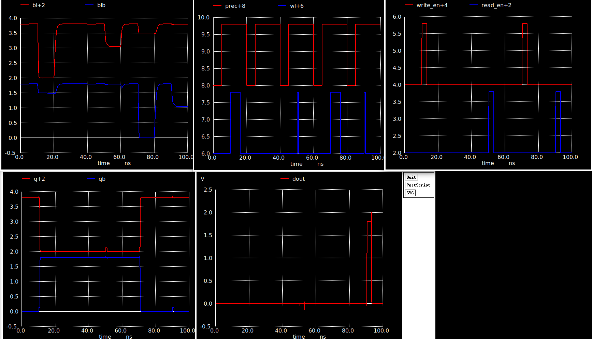
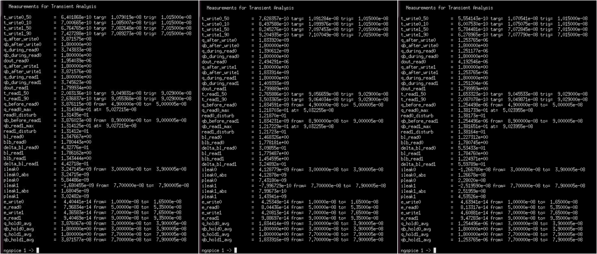
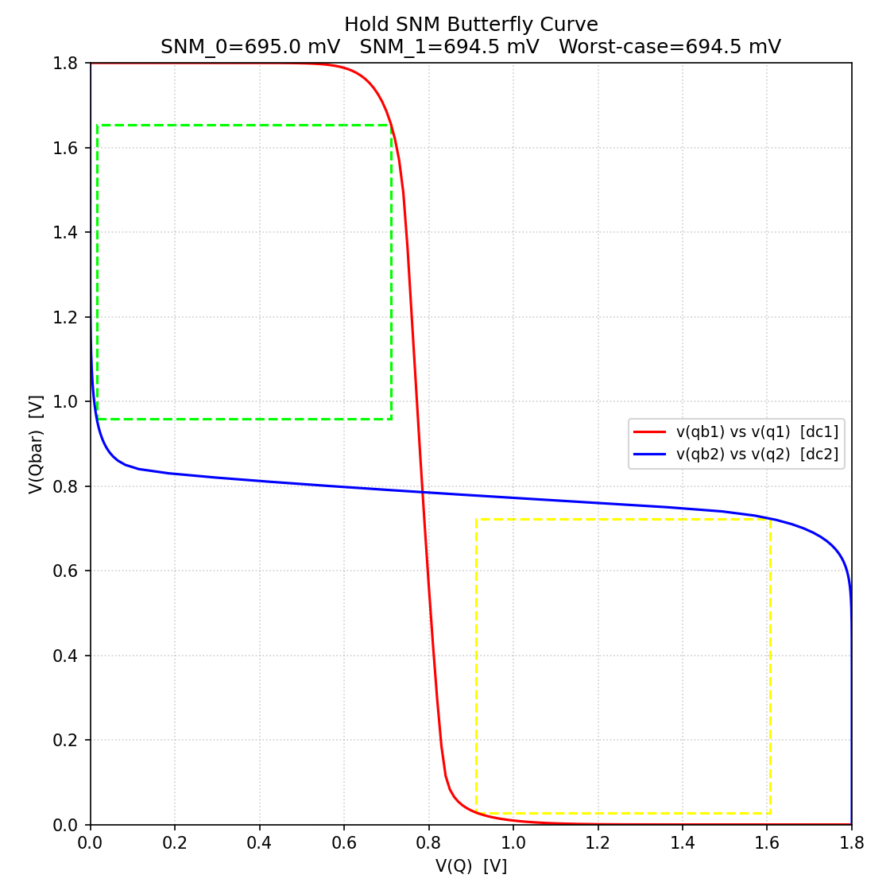
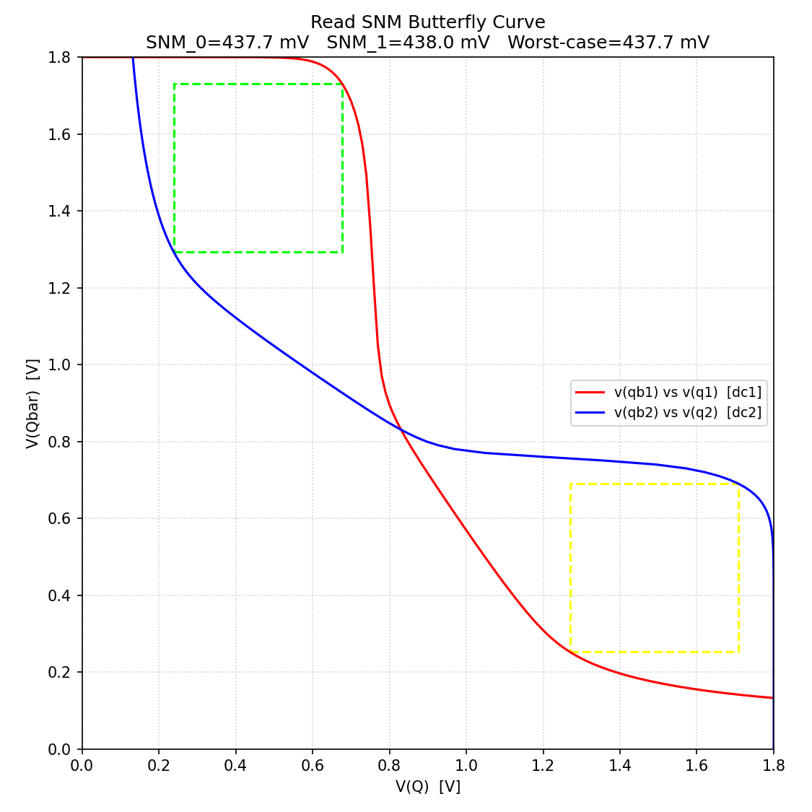
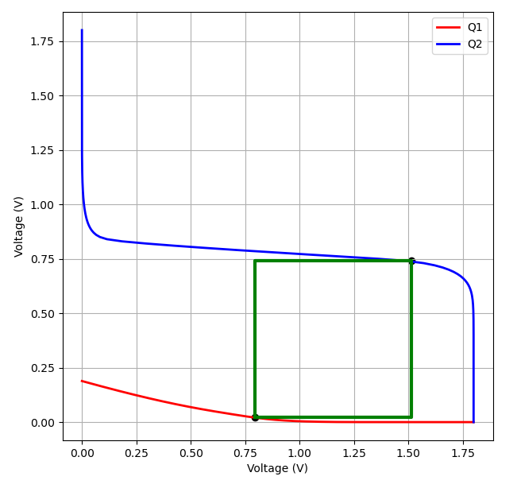

# Design and Characterization of a 1-Bit SRAM Cell in SKY130

| Field | Details |
|---|---|
| **Author** | Kaavya Siddharth Kamat |
| **Toolchain** | Xschem + ngspice + SKY130 |
| **VDD** | 1.8 V |
| **Temperature** | 27 °C |
| **Corners** | TT / SS / FF |
| **BL capacitance** | 400 fF |
| **BLB capacitance** | 400 fF |

---

## Table of Contents

1. [Objective](#objective)
2. [Circuit Architecture](#circuit-architecture)
3. [Transistor Sizing](#transistor-sizing)
4. [Simulation Setup](#simulation-setup)
5. [Functional Test Sequence](#functional-test-sequence)
6. [Timing Definitions](#timing-definitions)
7. [TT Results](#tt-results)
8. [Process Corner Comparison](#process-corner-comparison)
9. [Read Disturb](#read-disturb)
10. [Bitline Differential](#bitline-differential)
11. [Leakage (Standby)](#leakage-standby)
12. [Active-Window Energy](#active-window-energy)
13. [SNM](#snm)
14. [Discussion](#discussion)
15. [Conclusion](#conclusion)
16. [Possible Future Work](#possible-future-work)
17. [References](#references)
---

## Objective

The objective of this work is to design and characterize a 1-bit SRAM using SKY130 devices. The SRAM is evaluated for correct write, read, hold, timing, bitline development, read disturb, leakage, and operation energy across TT, SS, and FF process corners.

---

## Circuit Architecture

The top-level design consists of the following blocks:

| Block | Function |
|---|---|
| 6T SRAM cell | Stores one bit using cross-coupled inverters and access transistors |
| Precharge circuit | Charges BL and BLB to VDD before each operation |
| Write driver | Forces BL/BLB during write operations |
| Sense amplifier | Generates DOUT during read operations |

These circuits have been further elaborated [here](Week_2_and_3/readme.md) .

---

## Transistor Sizing

| Device Type | Width | Length |
|---|---:|---:|
| Pull-down NMOS | 1.26 µm | 0.15 µm |
| Access NMOS | 0.55 µm | 0.15 µm |
| Pull-up PMOS | 0.55 µm | 0.15 µm |

**Cell Ratio (CR):**

$$CR = \frac{W_{PD}}{W_{ACC}} = \frac{1.26}{0.55} \approx 2.29$$

**Pull-up Ratio (PR):**

$$PR = \frac{W_{PU}}{W_{ACC}} = \frac{0.55}{0.55} = 1$$

---

## Simulation Setup

| Parameter | Value |
|---|---|
| Technology | SKY130 |
| VDD | 1.8 V |
| Temperature | 27 °C |
| Process corners | TT, SS, FF |
| BL capacitance | 400 fF |
| BLB capacitance | 400 fF |
| Transient duration | 100 ns |
| Simulator | ngspice |

> Only the process model corner was changed between TT, SS, and FF simulations. VDD, temperature, stimulus timing, and bitline capacitance were kept constant.

---

## Functional Test Sequence

| Time | Operation |
|---|---|
|~10 ns | Write 0|
|~50 ns | Read 0|
|~70 ns | Write 1|
|~90 ns|  Read 1|

During write-0, Q is driven LOW and QB HIGH. The state is retained until the read operation. During read-0, DOUT remains LOW without disturbing the stored value. During write-1, Q is driven HIGH and QB LOW. During read-1, DOUT transitions HIGH and the stored state remains stable.

| Operation | Result |
|---|---|
| Write 0 | ✅ PASS |
| Read 0 | ✅ PASS |
| Write 1 | ✅ PASS |
| Read 1 | ✅ PASS |
| Hold | ✅ PASS |

---

## Timing Definitions

All delays are measured from the 50% crossing of the control signal to the 50% (or 10%/90%) crossing of the output node. [Reference](https://www.researchgate.net/publication/281835010_8T_Double-Ended_Read-Decoupled_SRAM_Cell)

**Write-0 @ 50%:**

$$t_{write0,50} = t(Q = 0.9\,\text{V}) - t(WL = 0.9\,\text{V})$$

**Write-0 completion @ 10%:**

$$t_{write0,10} = t(Q = 0.18\,\text{V}) - t(WL = 0.9\,\text{V})$$

**Write-1 @ 50%:**

$$t_{write1,50} = t(Q = 0.9\,\text{V}) - t(WL = 0.9\,\text{V})$$

**Write-1 completion @ 90%:**

$$t_{write1,90} = t(Q = 1.62\,\text{V}) - t(WL = 0.9\,\text{V})$$

**Read-1 @ 50%:**

$$t_{read1,50} = t(DOUT = 0.9\,\text{V}) - t(read\_en = 0.9\,\text{V})$$

**Read-1 @ 90%:**

$$t_{read1,90} = t(DOUT = 1.62\,\text{V}) - t(read\_en = 0.9\,\text{V})$$

---

## TT Results

| Parameter | TT |
|---|---:|
| Write-0 @ 50% | 0.640 ns |
| Write-0 @ 10% (completion) | 0.700 ns |
| Write-1 @ 50% | 0.676 ns |
| Write-1 @ 90% (completion) | 0.743 ns |
| Read-1 @ 50% | 0.208 ns |
| Read-1 @ 90% | 0.264 ns |
| Read disturb (stored 0) | 131.4 mV |
| Read disturb (stored 1) | 131.4 mV |
| ΔBL Read 0 | 432.8 mV |
| ΔBL Read 1 | 442.7 mV |
| Leakage current (stored 0) | 3.247 nA |
| Leakage current (stored 1) | 1.680 nA |
| Leakage power (stored 0) | 5.845 nW |
| Leakage power (stored 1) | 3.025 nW |
| Write-0 active-window energy | 44.04 fJ |
| Write-1 active-window energy | 43.66 fJ |
| Read-0 active-window energy | 79.68 fJ |
| Read-1 active-window energy | 94.05 fJ |

The write-0 and write-1 delays are closely matched, indicating reasonably symmetric write performance. Read-1 access is significantly faster than write completion. The bitline differential exceeds 430 mV for both stored states, providing a strong input to the sense amplifier.

---

## Process Corner Comparison

Raw Measurements - 

| Parameter | FF | TT | SS | Trend / Comment |
|---|---:|---:|---:|---|
| Write-0 @ 50% | **0.555 ns** | **0.640 ns** | **0.763 ns** | SS > TT > FF ✅ |
| Write-0 @ 10% | **0.601 ns** | **0.700 ns** | **0.850 ns** | SS > TT > FF ✅ |
| Write-1 @ 50% | **0.578 ns** | **0.676 ns** | **0.825 ns** | SS > TT > FF ✅ |
| Write-1 @ 90% | **0.628 ns** | **0.743 ns** | **0.920 ns** | SS > TT > FF ✅ |
| Read-1 @ 50% | **0.165 ns** | **0.208 ns** | **0.277 ns** | SS > TT > FF ✅ |
| Read-1 @ 90% | **0.208 ns** | **0.264 ns** | **0.350 ns** | SS > TT > FF ✅ |
| Read disturb - stored 0 | **138.2 mV** | **131.4 mV** | **121.9 mV** | FF > TT > SS✅ |
| Read disturb - stored 1 | **138.2 mV** | **131.4 mV** | **121.7 mV** | FF > TT > SS✅ |
| ΔBL - Read 0 | **553.4 mV** | **432.8 mV** | **309.9 mV** | FF > TT > SS ✅ |
| ΔBL - Read 1 | **559.8 mV** | **442.7 mV** | **324.9 mV** | FF > TT > SS ✅ |
| Leakage current - stored 0 | **12.67 nA** | **3.247 nA** | **4.129 nA** | Strong corner/state dependence |
| Leakage current - stored 1 | **25.20 nA** | **1.680 nA** | **0.800 nA** | Strong corner/state dependence |
| Leakage power - stored 0 | **22.80 nW** | **5.845 nW** | **7.432 nW** | Follows leakage current |
| Leakage power - stored 1 | **45.35 nW** | **3.025 nW** | **1.439 nW** | Follows leakage current |
| Write-0 active-window energy | **46.39 fJ** | **44.04 fJ** | **42.53 fJ** | Similar magnitude across corners |
| Write-1 active-window energy | **45.09 fJ** | **43.66 fJ** | **42.08 fJ** | Similar magnitude across corners |
| Read-0 active-window energy | **81.33 fJ** | **79.68 fJ** | **80.44 fJ** | Very similar |
| Read-1 active-window energy | **94.73 fJ** | **94.05 fJ** | **98.87 fJ** | Similar magnitude |

**Delay ordering across corners:**

$$t_{SS} > t_{TT} > t_{FF}$$

FF devices switch faster, resulting in the lowest write/read delays and the largest bitline differential. SS devices switch more slowly, resulting in increased access time and reduced bitline differential. TT lies between the two.

---

## Read Disturb

Read disturb is the temporary increase in value of the low storage node during a read operation due to charge sharing through the access transistor.

**For stored 0 (Read-0):** Q = 0, QB = 1.8 V → monitor the rise on Q.

**For stored 1 (Read-1):** Q = 1.8 V, QB = 0 → monitor the rise on QB.

The low storage node rises temporarily during read due to charge sharing through the access transistor. At TT, the maximum disturbance is approximately **131.4 mV** for both stored states. The cell returns to the correct value after the read and does not flip.

---

## Bitline Differential

The bitline differential is defined as:

$$\Delta V_{BL} = |V(BL) - V(BLB)|$$

| Corner | Read 0 | Read 1 |
|---|---:|---:|
| FF | ~553 mV | ~560 mV |
| TT | 433 mV | 443 mV |
| SS | ~310 mV | ~325 mV |

The bitline differential decreases from FF to SS due to reduced cell drive current at the slower process corner. Even at SS, the differential remains approximately 0.31–0.33 V at the selected sample time.

---

## Leakage (Standby)

| Corner | State | Leakage Current | Leakage Power |
|---|---|---:|---:|
| TT | Stored 0 | 3.247 nA | 5.845 nW |
| TT | Stored 1 | 1.680 nA | 3.025 nW |
| SS | Stored 0 | ~4.13 nA | ~7.43 nW |
| SS | Stored 1 | ~0.80 nA | ~1.44 nW |
| FF | Stored 0 | ~12.67 nA | ~22.80 nW |
| FF | Stored 1 | ~25.16 nA | ~45.35 nW |

Leakage is state-dependent because different transistor stacks are OFF for stored 0 and stored 1. The measured current is the total standby supply leakage of the complete 1-bit SRAM circuit, not exclusively subthreshold leakage.

---

## Active-Window Energy

> **Note:** These are active-window supply energies, not total-cycle energies. Values are obtained by integrating supply power only over the active write/read windows. Precharge energy occurring outside the selected integration interval is not included.

| Operation | TT | SS | FF |
|---|---:|---:|---:|
| Write 0 | 42.53 fJ | ~45.75 fJ | ~46.39 fJ |
| Write 1 | 43.66 fJ | ~42.08 fJ | ~46.09 fJ |
| Read 0 | 79.68 fJ | ~80.44 fJ | ~81.33 fJ |
| Read 1 | 94.05 fJ | ~98.87 fJ | ~94.73 fJ |

---

## SNM

### Hold SNM

- Method: DC sweep of cross-coupled inverter transfer curves
- Metric: Side length of largest inscribed square in the butterfly
- Result: [694.5 mV]

### Read SNM

- Condition: WL = ON, BL/BLB precharged to VDD
- Method: Butterfly curve with access transistors active
- Result: [437.7 mV]

### Write SNM / Write Margin

- Condition: Write driver asserting BL/BLB, WL = ON
- Method: Butterfly Curve
- Result: [708.3 mV]

---

## Discussion

The SRAM operates correctly across TT, SS, and FF process corners at 1.8 V and 27 °C with 400 fF bitline loading. As expected, FF produces the fastest write and read response, while SS produces the slowest. The bitline differential also follows FF > TT > SS, consistent with corner-dependent transistor drive strength. The write delay remains below approximately 1 ns across all three corners. Read disturb remains well below the supply voltage and does not cause a state flip. Standby leakage shows strong dependence on both process corner and stored state.

---

## Conclusion

A functional 1-bit SRAM was designed and characterized using SKY130 devices. Correct write, hold, and read operation was verified. Timing, bitline differential, read disturb, leakage, and active-window energy were extracted at TT, SS, and FF corners. The cell showed the expected process-corner timing behavior, with FF fastest and SS slowest, while maintaining correct operation with 400 fF loading on each bitline. Further characterization includes Hold SNM, Read SNM, Write SNM, and post-layout analysis.

---

## Possible Future Work

-Layouts and Post Layout simulation .

-Optimization of layout design of custom cells for better cell fitting and compiling custom cells using OpenRAM.

---

## References

-Design of 1024x32 SRAM (32Kbits) using OpenRAM and SKY130 PDKs by Shon Taware : https://github.com/ShonTaware/SRAM_SKY130

-VLSI System Design: https://www.vlsisystemdesign.com

---
